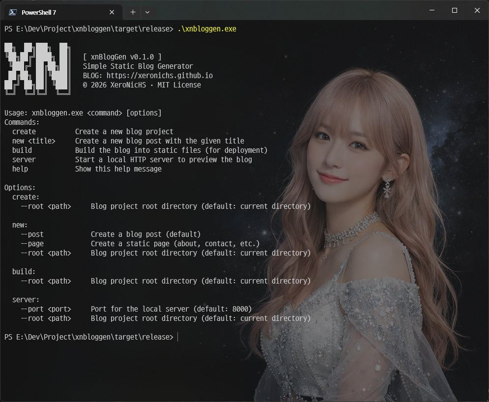

# xnBlogGen

[](LICENSE)
[](https://www.rust-lang.org) <br/>


> **Language**: [🇰🇷 한국어](README.md) | [🇺🇸 English](README.en.md)

**Rust로 작성된 빠르고 간단한 정적 블로그 생성기**



xnBlogGen은 마크다운으로 작성된 포스트를 정적 HTML로 변환하는 블로그 생성기입니다. Jinja 스타일의 템플릿 엔진을 사용하며, 테마 시스템을 통해 디자인을 쉽게 커스터마이징할 수 있습니다.

## 주요 특징

- 🚀 **빠른 빌드**: Rust의 성능으로 대량의 포스트도 빠르게 처리
- 🎨 **테마 시스템**: Jinja 템플릿 기반의 유연한 테마 커스터마이징
- 📝 **마크다운 지원**: 직관적인 마크다운 문법으로 글 작성
- 🏷️ **동적 분류 체계**: 테마에서 정의 가능한 유연한 taxonomy 시스템 (태그, 카테고리 외 확장 가능)
- 📄 **페이지네이션**: 홈, 분류, 아카이브 페이지의 자동 페이지 분할 지원
- ✨ **코드 하이라이팅**: 마크다운 코드 블록의 자동 문법 강조 (syntect)
- 📡 **RSS & Sitemap**: 자동 생성되는 RSS 피드와 사이트맵
- 🔗 **유연한 Permalink**: 날짜, 슬러그 기반 URL 패턴 지원
- 📋 **페이지 지원**: 포스트 외에 About, Contact 등 독립 페이지 생성

## 설치

### Cargo를 통한 설치

```bash
git clone https://github.com/XeroNicHS/xnbloggen
cd xnbloggen
cargo build --release
```

빌드된 실행 파일은 `target/release/xnbloggen.exe` (Windows) 또는 `target/release/xnbloggen` (Linux/macOS)에 생성됩니다.

### 시스템 요구사항

- Rust 2024 Edition 이상
- Windows, Linux, macOS 지원

## 빠른 시작

5분 안에 블로그를 만들어보세요!

```bash
# 1. 새 블로그 프로젝트 생성
xnbloggen create --root myblog

# 2. 첫 번째 포스트 작성
cd myblog
xnbloggen new "첫 번째 포스트"

# 3. 마크다운 파일 편집
# content/posts/YYYY-MM-DD-첫-번째-포스트.md 파일을 열어 내용 작성

# 4. 빌드
xnbloggen build

# 5. 로컬에서 확인 (임시 방법)
xnbloggen server
# 브라우저에서 http://localhost:8000 접속
```

### 1. 프로젝트 생성 (`create`)

새로운 블로그 프로젝트를 초기화합니다. 기본 디렉토리 구조, 설정 파일, 기본 테마를 자동으로 생성합니다.

```bash
# 지정된 경로에 프로젝트 생성
xnbloggen create --root myblog

# 현재 디렉토리에 프로젝트 초기화
cd myblog
xnbloggen create
```

**옵션:**
- `--root <경로>`: 프로젝트 루트 디렉토리 (기본값: 현재 디렉토리)

**생성되는 구조:**
```
myblog/
├── blogconfig.yaml     # 블로그 설정 파일
├── content/            # 컨텐츠 폴더
│   ├── posts/          # 포스트 저장 위치
│   ├── pages/          # 페이지 저장 위치
│   ├── images/         # 이미지 저장 위치
│   └── data/           # 데이터 저장 위치
└── themes/             # 테마 폴더
    └── default/        # 기본 테마
        ├── theme.yaml
        ├── assets/
        └── templates/
```

### 2. 글 작성 (`new`)

새로운 포스트 또는 페이지를 생성합니다. Front Matter가 포함된 마크다운 파일이 자동으로 만들어집니다.

```bash
# 포스트 생성 (기본)
xnbloggen new "나의 첫 포스트"
# → content/posts/2026-01-24-나의-첫-포스트.md

# 페이지 생성
xnbloggen new "About" --page
# → content/pages/About.md

# 경로 지정
xnbloggen new "새 글" --root myblog
```

**옵션:**
- `--page`: 페이지 생성 (포스트 대신)
- `--root <경로>`: 프로젝트 루트 디렉토리

**포스트와 페이지의 차이:**
- **포스트**: 날짜 기반으로 정렬되는 블로그 글 (뉴스, 일기, 튜토리얼 등)
- **페이지**: 독립적인 정적 페이지 (About, Contact, Portfolio 등)

### 이미지 관리

xnBlogGen은 3가지 이미지 관리 패턴을 지원하며, **자동으로 감지하여 처리**합니다. 한 프로젝트에서 여러 패턴을 혼용할 수 있습니다.

#### 패턴 1: 중앙 집중 방식 (기존 방식)

모든 이미지를 `content/images/` 폴더에 저장하고 절대 경로로 참조합니다.

**구조:**
```
content/
├── images/
│   ├── thumbnails/
│   │   └── shared-thumb.jpg
│   └── 2024/01/
│       └── diagram.png
└── posts/
    └── 2024-01-15-my-post.md
```

**Front Matter & 본문:**
```yaml
---
thumbnail: "/images/thumbnails/shared-thumb.jpg"
---


```

**장점:**
- 여러 포스트에서 같은 이미지 재사용 가능
- Obsidian에서 `content/` 폴더를 vault로 열어 미리보기 가능

---

#### 패턴 2: 평면 구조 + 파일명 규칙

포스트와 같은 폴더에 이미지를 배치하고, 파일명 prefix로 연결합니다.

**구조:**
```
content/posts/
├── 2024-01-15-my-post.md
├── 2024-01-15-my-post-diagram.png    # 날짜 포함
├── my-post-thumbnail.jpg              # slug만
└── my-post-photo.jpg
```

**Front Matter & 본문:**
```yaml
---
thumbnail: "./my-post-thumbnail.jpg"
---


```

**장점:**
- 단일 md 파일을 열어도 같은 폴더에 이미지가 있어 미리보기 가능
- 파일명으로 연관성 명확
- 날짜 포함/제외 모두 자동 인식

---

#### 패턴 3: 폴더 구조

포스트를 폴더로 만들고 `index.md`와 이미지를 함께 보관합니다.

**구조:**
```
content/posts/
└── 2024-01-15-my-post/
    ├── index.md
    ├── diagram.png        # 짧은 파일명
    ├── photo.jpg
    └── thumbnail.jpg
```

**Front Matter & 본문:**
```yaml
---
thumbnail: "./thumbnail.jpg"
---


```

**장점:**
- 가장 깔끔한 구조
- 이미지 파일명 가장 짧음 (prefix 불필요)
- 포스트-이미지 응집도 최고
- VSCode로 폴더 열면 미리보기 완벽

---

#### 빌드 시 처리

- **본문 이미지**: 상대 경로 그대로 유지 → 브라우저가 자동 해석
- **썸네일**: Front Matter의 상대 경로 → 절대 경로로 자동 변환
- 모든 이미지는 `public/{포스트-url}/` 폴더에 복사됨
- 패턴 혼용 가능 (프로젝트 내 여러 패턴 공존)

**지원 이미지 형식:**
- `png`, `jpg`, `jpeg`, `gif`, `webp`, `svg`, `avif`, `bmp`, `ico`, `tiff`, `tif`

### 3. 빌드 (`build`)

마크다운 파일들을 HTML로 변환하여 배포 가능한 정적 사이트를 생성합니다.

```bash
# 프로젝트 빌드
xnbloggen build

# 경로 지정
xnbloggen build --root myblog
```

**생성되는 파일들:**
- 홈 페이지 (`index.html`, `/page/N/index.html` - 페이지네이션)
- 개별 포스트 페이지 (permalink 패턴에 따라)
- 개별 페이지
- **Taxonomy 목록 페이지** (theme.yaml 설정 기반, 페이지네이션 포함)
  - 예: `/tags/:tag/index.html`, `/categories/:category/index.html`
  - theme.yaml에 정의한 taxonomy만 생성
- 아카이브 페이지 (Yearly/Monthly/Daily 선택 가능, 페이지네이션 포함)
  - 예: `/archives/YYYY/index.html`, `/archives/YYYY/MM/index.html`, `/archives/YYYY/MM/DD/index.html`
- RSS 피드 (`/rss.xml`)
- 사이트맵 (`/sitemap.xml`)
- robots.txt (`/robots.txt`)
- 정적 assets (CSS, JS, 이미지)

**옵션:**
- `--root <경로>`: 프로젝트 루트 디렉토리

### Permalink 패턴

포스트 URL 구조를 `blogconfig.yaml`의 `permalinks` 항목에서 전역으로 설정합니다.

**지원하는 패턴:**
- `:year` - 연도 (4자리, 예: 2026)
- `:month` - 월 (2자리, 예: 01)
- `:day` - 일 (2자리, 예: 24)
- `:slug` - 파일명에서 추출한 슬러그

**예제:**
```yaml
# blogconfig.yaml
permalinks:
  post: "/post/:year/:month/:day/:slug/"
# → /post/2026/01/24/my-first-post/

permalinks:
  post: "/:slug/"
# → /my-first-post/
```

### 분류 체계 (Taxonomy)

포스트를 체계적으로 분류하고 목록 페이지를 자동 생성합니다.

#### 동적 Taxonomy 시스템

테마 설정(`theme.yaml`)에서 원하는 taxonomy를 자유롭게 정의할 수 있습니다.

**완전 동적 구조:**
- `theme.yaml`의 `taxonomies` 설정에서 정의한 분류 체계만 생성됨
- tags, categories도 특별한 것이 아니라 taxonomy의 일종
- 설정하지 않은 taxonomy는 생성되지 않음
- 각 taxonomy는 독립적인 URL 구조와 목록 페이지를 가짐
- 모든 taxonomy 페이지는 페이지네이션 지원

**일반적인 예시:**
- `tags`: 키워드 기반 자유로운 분류 (URL: `/tags/<tag-name>/`)
- `categories`: 계층적 주제 분류 (URL: `/categories/<category-name>/`)
- `series`: 연재물 분류 (URL: `/series/<series-name>/`)
- `authors`: 작성자별 분류 (URL: `/authors/<author-name>/`)

> 💡 어떤 이름의 taxonomy도 정의 가능하며, Front Matter에서 해당 이름으로 값을 지정하면 자동으로 인덱스 및 목록 페이지가 생성됩니다.

**아카이브 (Archives):**
- 날짜 기반 자동 분류
- Yearly/Monthly/Daily 그룹화 선택 가능 (theme.yaml에서 설정)
- **permalink 패턴 사용자 정의 가능** (theme.yaml의 `archives.permalink`에서 설정)
  - `:year`, `:month`, `:day` 변수 사용 가능
  - 예: `/archives/:year/`, `/archives/:year/:month/`, `/blog/:year/:month/:day/`
- 페이지네이션 지원

### 4. 로컬 개발 서버 (`server`)

빌드된 사이트를 로컬에서 미리보기할 수 있는 HTTP 서버를 제공합니다.

```bash
# 기본 포트(8000)로 서버 시작
xnbloggen server
# → http://localhost:8000 에서 확인

# 포트 지정
xnbloggen server --port 3000

# 경로 지정
xnbloggen server --root myblog --port 8080
```

**옵션:**
- `--root <경로>`: 프로젝트 루트 디렉토리 (기본값: 현재 디렉토리)
- `--port <포트>`: 서버 포트 번호 (기본값: 8000)

**기능:**
- 정적 파일 서빙 (HTML, CSS, JS, 이미지 등)
- 자동 Content-Type 감지
- index.html 자동 서빙
- 보안 강화 (path traversal 방어)

> ⚠️ **주의**: 개발/테스트 전용 기능입니다. 실제 서비스용으로 사용하지 마세요. 배포 시에는 빌드된 `public/` 폴더를 웹 서버(Nginx, Apache) 또는 호스팅 서비스(GitHub Pages, Netlify, Vercel)에 업로드하세요.

## 설정 파일

### blogconfig.yaml

블로그 전역 설정 파일입니다. 프로젝트 루트에 위치하며 사이트 정보, 저자 정보, 테마, 빌드 옵션을 설정합니다.

```yaml
site: 
  name: "My xnBlogGen Blog"          # 블로그 이름
  base_url: "https://yourblog.com"   # 블로그 URL
  path: ""                           # 서브 경로 (예: /blog)
  description: "개인 블로그"         # 블로그 설명
  language: "ko"                     # 언어 코드

author:
  name: "Your Name"                  # 작성자 이름
  email: "your@email.com"            # 이메일 (선택)

theme: 
  name: "default"                    # 사용할 테마 이름

permalinks:
  post: "/posts/:slug/"              # 포스트 permalink
  page: "/pages/:slug/"              # 개별 페이지 permalink

build:
  output_dir: "public"               # 빌드 출력 디렉토리
  clean: true                        # 빌드 전 출력 디렉토리 초기화
  include_drafts: false              # 초안(draft) 포함 여부
  rss: true                          # RSS 피드 생성
  rss_max_items: 20                  # RSS 최대 항목 수
  sitemap: true                      # 사이트맵 생성
  robots_txt: true                   # robots.txt 생성
```

### 테마 사용하기

기본 테마 외에 다른 테마를 사용하려면 테마를 `themes` 폴더에 추가하고 `blogconfig.yaml`에서 지정하면 됩니다.

**예시: simple-black 테마 사용**

1. 테마 저장소를 `themes` 폴더에 클론:
   ```bash
   git clone https://github.com/XeroNicHS/theme-simple-black themes/simple-black
   ```

2. `blogconfig.yaml`에서 테마 지정:
   ```yaml
   theme:
     name: "simple-black"
   ```

3. 빌드 실행:
   ```bash
   xnbloggen build
   ```

### theme.yaml

테마별 설정 파일입니다. `themes/<테마이름>/theme.yaml`에 위치합니다.

```yaml
meta:
  name: "default"
  version: "1.0.0"
  author: "xnBlogGen"
  description: "Minimal starter theme for xnBlogGen"

template_default:
  post: "post.html"                 # 포스트 템플릿
  page: "page.html"                 # 페이지 템플릿
  home: "home.html"                 # 홈 페이지 템플릿
  list: "list.html"                 # 목록 페이지 템플릿

# 커스텀 템플릿 정의 (선택 사항)
# 기본 템플릿 외에 추가 페이지를 생성하려면 아래와 같이 정의
template_extra: []
# 예시:
# template_extra:
#   - name: "Search"
#     file: "search.html"           # templates 폴더를 기준으로 찾습니다.
#     url: "/search/"
#     output: "index.html"          # 출력 파일명 (기본값: "index.html", 생략 가능)
#
#   # 특정 파일명이 필요한 경우 (예: 404 페이지)
#   - name: "404 Page"
#     file: "404.html"
#     url: "/"
#     output: "404.html"            # /404.html로 생성

# Taxonomy 설정 (선택 사항)
# 원하는 분류 체계를 자유롭게 정의
taxonomies:
  - name: "tags"                    # Front Matter에서 사용할 key 이름
    label: "Tag"                    # 목록 제목 표시용 ("Tag: Rust")
    permalink: "/tags/:slug/"       # Taxonomy 목록 페이지 URL 패턴
    per_page: 10                    # 페이지당 포스트 수

  - name: "categories"
    label: "Category"
    permalink: "/categories/:slug/"
    per_page: 10

  # 추가 taxonomy 예시:
  # - name: "series"
  #   label: "Series"
  #   permalink: "/series/:slug/"
  #   per_page: 10

# Archive 설정 (선택 사항)
# Yearly, Monthly, Daily 선택 가능
archives:
  - kind: "Monthly"  # "Yearly", "Monthly", "Daily" 중 선택
    permalink: "/archives/:year/:month/"  # :year, :month, :day 변수 사용 가능
    per_page: 10
  # Yearly 예시: kind: "Yearly", permalink: "/archives/:year/"
  # Daily 예시: kind: "Daily", permalink: "/archives/:year/:month/:day/"

recent_posts:
  count: 10

# 테마별 커스텀 설정 (선택 사항)
# theme.yaml에 정의한 모든 필드는 템플릿에서 {{ site.theme.필드명 }}으로 접근 가능
# 예시:
# colors:
#   primary: "#58a6ff"
#   secondary: "#1f6feb"
# social_links:
#   github: "https://github.com/username"
#   twitter: "https://twitter.com/username"
# features:
#   enable_search: true
#   enable_toc: true
```

### Front Matter

마크다운 파일 상단의 YAML 메타데이터입니다.

**포스트 Front Matter:**
```yaml
---
title: "포스트 제목"
slug: "포스트-제목"
date: 2026-01-24T14:30:00+09:00
updated: 2026-01-26T10:00:00+09:00   # 수정 날짜 (선택)

# theme.yaml의 taxonomies 설정에 따라 원하는 분류 지정
taxonomies:
  tags: ["Rust", "블로그"]        # theme.yaml에 tags가 정의된 경우
  categories: ["개발"]            # theme.yaml에 categories가 정의된 경우
  series: ["Rust 입문"]           # theme.yaml에 series가 정의된 경우 (예시)

summary: "Write a brief summary of your post here."
description: "SEO를 위한 페이지 설명 (meta description)"  # SEO용 설명 (선택)
thumbnail: ""
language: "ko"                     # 포스트 언어 (선택, 기본값: 사이트 언어)

draft: false

# 사용자 정의 필드 (extra)
author: "홍길동"                   # 템플릿에서 post.extra.author로 접근
reading_time: 5                   # 템플릿에서 post.extra.reading_time으로 접근
difficulty: "중급"                # 템플릿에서 post.extra.difficulty로 접근
---

본문 내용...
```

**페이지 Front Matter:**
```yaml
---
title: "About"
slug: "about"
date: 2026-01-24T14:30:00+09:00

draft: false
---

페이지 내용...
```

**필드 설명:**
- `title` (필수): 글 제목
- `date` (필수): 발행 날짜
- `slug` (선택): URL 슬러그 (미지정 시 제목에서 자동 생성)
- `updated` (선택): 수정 날짜 (sitemap의 lastmod에 사용됨)
- `taxonomies` (선택): theme.yaml에 정의된 taxonomy별 값 배열
  - key는 theme.yaml의 taxonomies에 정의된 이름
  - value는 해당 taxonomy의 값 배열
- `summary` (선택): 포스트 요약
- `description` (선택): SEO를 위한 페이지 설명 (meta description 태그에 사용)
- `thumbnail` (선택): 썸네일 이미지 경로
- `language` (선택): 포스트 언어 코드 (기본값: 사이트 언어)
- `draft` (선택): 초안 여부 (true면 빌드 시 제외, 기본값: false)
- **사용자 정의 필드 (extra)**: 위에 정의되지 않은 모든 필드는 `extra` 객체에 저장되어 템플릿에서 `post.extra.필드명` 또는 `page.extra.필드명`으로 접근 가능

## 사용자 정의 필드 (extra)

Front Matter에 추가 필드를 정의하여 템플릿에서 자유롭게 사용할 수 있습니다.

**Front Matter 예시:**
```yaml
---
title: "포스트 제목"
date: 2026-01-24T14:30:00+09:00

# 사용자 정의 필드
author: "홍길동"
reading_time: 5
difficulty: "중급"
featured: true
---
```

**템플릿 사용 (post.html):**
```jinja

  <span class="author">작성자: {{ post.extra.author }}</span>



  <span class="reading-time">읽는 시간: {{ post.extra.reading_time }}분</span>



  <span class="difficulty">난이도: {{ post.extra.difficulty }}</span>



  <span class="badge">✨ 추천 글</span>

```

이 기능을 통해 테마를 수정하지 않고도 포스트별로 다양한 메타데이터를 추가할 수 있습니다.

## 테마 커스터마이징

테마는 Jinja 템플릿 엔진을 사용합니다. 자세한 템플릿 변수 및 사용법은 [docs/template-context.md](docs/template-context.md)를 참고하세요.

**템플릿 파일:**
- `home.html` - 홈 페이지 (최신 포스트 목록)
- `post.html` - 개별 포스트 페이지
- `page.html` - 개별 페이지
- `list.html` - 목록 페이지 (태그/카테고리/아카이브)
- `base.html` - 기본 레이아웃

**주요 템플릿 변수:**

**공통 변수 (모든 템플릿):**
- `{{ site.title }}` - 블로그 이름
- `{{ site.base_url }}` - 블로그 기본 URL
- `{{ site.description }}` - 블로그 설명
- `{{ site.author }}` - 작성자 이름
- `{{ site.recent_posts }}` - 최근 포스트 목록 (theme.yaml의 recent_posts.count만큼)
  - 각 항목: title, url, date, taxonomies, summary, thumbnail 포함
- `{{ site.taxonomies }}` - 모든 taxonomy 맵 (BTreeMap<String, Vec<TaxonomyItem>>)
  - theme.yaml에 정의된 taxonomy별로 자동 생성
  - 예: `{{ site.taxonomies.tags }}` - 태그 목록 (theme.yaml에 tags가 정의된 경우)
  - 예: `{{ site.taxonomies.categories }}` - 카테고리 목록 (theme.yaml에 categories가 정의된 경우)
  - 각 항목: label, url, count 포함
- `{{ site.archives }}` - 아카이브 목록
  - 각 항목: kind ("yearly"/"monthly"/"daily"), label, year, month (Optional), day (Optional), url, count

**home.html 전용:**
- `{{ home.title }}` - 홈 페이지 제목
- `{{ home.posts }}` - 최신 포스트 목록 (title, url, date, summary, thumbnail)
- `{{ home.pagination }}` - 페이지네이션 정보
  - `page`, `per_page`, `total_items`, `total_pages` - 페이지 정보
  - `has_prev`, `has_next` - 이전/다음 페이지 존재 여부
  - `prev`, `next` - 이전/다음 페이지 링크 (title, url)
  - `first`, `last` - 첫/마지막 페이지 링크 (title, url)
  - `pages` - 페이지 번호 목록 (number, url, is_current)

**list.html 전용:**
- `{{ list.title }}` - 목록 제목 (예: "태그: Rust", "2026년 1월")
- `{{ list.posts }}` - 필터링된 포스트 목록 (title, url, date, summary, thumbnail)
- `{{ list.list_kind }}` - 목록 종류
- `{{ list.pagination }}` - 페이지네이션 정보 (home.pagination과 동일한 구조)

**post.html 전용:**
- `{{ post.title }}` - 포스트 제목
- `{{ post.url }}` - 포스트 URL
- `{{ post.date }}` - 발행 날짜
- `{{ post.content_html }}` - HTML 변환된 본문 (코드 하이라이팅 적용됨)
- `{{ post.taxonomies }}` - 포스트의 taxonomy 맵 (BTreeMap)
  - Front Matter에 지정한 taxonomy별로 자동 생성
  - 예: `{{ post.taxonomies.tags }}` - 포스트의 태그 목록 (label, url)
  - 예: `{{ post.taxonomies.categories }}` - 포스트의 카테고리 목록 (label, url)
  - 각 항목: label, url 포함
- `{{ post.summary }}` - 요약
- `{{ post.thumbnail }}` - 썸네일 이미지
- `{{ post.prev }}` - 이전 포스트 링크 (title, url)
- `{{ post.next }}` - 다음 포스트 링크 (title, url)

**page.html 전용:**
- `{{ page.title }}` - 페이지 제목
- `{{ page.url }}` - 페이지 URL
- `{{ page.date }}` - 발행 날짜
- `{{ page.content_html }}` - HTML 변환된 본문

**템플릿 예제:**

```jinja
{# post.html 예제 #}
<article>
  <h1>{{ post.title }}</h1>
  <time>{{ post.date }}</time>

  <div class="content">
    {{ post.content_html | safe }}
  </div>

  {# theme.yaml에 tags가 정의된 경우 #}
  
    <div class="tags">
      
        <a href="{{ tag.url }}">{{ tag.label }}</a>
      
    </div>
  

  <nav class="post-nav">
    
      <a href="{{ post.prev.url }}">← {{ post.prev.title }}</a>
    
    
      <a href="{{ post.next.url }}">{{ post.next.title }} →</a>
    
  </nav>
</article>

{# home.html 또는 list.html - 페이지네이션 예제 #}

  <nav class="pagination">
    
      <a href="{{ home.pagination.prev.url }}">← 이전</a>
    

    
      
        <strong>{{ page.number }}</strong>
      
        <a href="{{ page.url }}">{{ page.number }}</a>
      
    

    
      <a href="{{ home.pagination.next.url }}">다음 →</a>
    
  </nav>


{# 사이드바 (공통 - base.html) #}
<aside>
  {# theme.yaml에 정의된 taxonomy만 표시 #}
  
    <h3>태그</h3>
    <ul>
      
        <li>
          <a href="{{ tag.url }}">{{ tag.label }} ({{ tag.count }})</a>
        </li>
      
    </ul>
  

  
    <h3>카테고리</h3>
    <ul>
      
        <li>
          <a href="{{ category.url }}">{{ category.label }} ({{ category.count }})</a>
        </li>
      
    </ul>
  

  <h3>아카이브</h3>
  <ul>
    
      <li>
        <a href="{{ archive.url }}">{{ archive.label }} ({{ archive.count }})</a>
      </li>
    
  </ul>
</aside>
```

## 프로젝트 구조

```
myblog/
├── blogconfig.yaml         # 블로그 전역 설정
├── content/                # 컨텐츠 폴더
│   ├── posts/              # 포스트 (.md 파일)
│   │   └── 2026-01-24-첫-포스트.md
│   ├── pages/              # 페이지 (.md 파일)
│   │   └── About.md
│   ├── images/             # 이미지 (public/images로 복사됨)
│   │   └── profile.jpg
│   └── data/               # 추가 데이터 파일 (public/data로 복사됨)
│       └── example.json
├── themes/                 # 테마 폴더
│   └── default/            # 기본 테마
│       ├── theme.yaml      # 테마 설정
│       ├── assets/         # 정적 파일
│       │   ├── css/
│       │   │   └── style.css
│       │   ├── js/
│       │   │   └── main.js
│       │   └── images/
│       │       └── logo.png
│       └── templates/      # 템플릿 파일
│           ├── base.html
│           ├── home.html
│           ├── post.html
│           ├── page.html
│           └── list.html
└── public/                 # 빌드 출력 (자동 생성)
    ├── index.html
    ├── page/               # 홈 페이지네이션 (2페이지부터)
    ├── posts/              # 개별 포스트 페이지
    ├── pages/              # 개별 일반 페이지
    ├── tags/               # theme.yaml에 tags 정의 시
    ├── categories/         # theme.yaml에 categories 정의 시
    ├── archives/           # 아카이브 (Yearly/Monthly/Daily, 자동 생성)
    ├── assets/             # 테마 정적 파일
    ├── images/             # content/images 복사
    ├── data/               # content/data 복사
    ├── rss.xml
    ├── sitemap.xml
    └── robots.txt
```

## 배포

빌드가 완료되면 `blogconfig.yaml`의 `build.output_dir`에 지정된 디렉토리(기본값: `public/`)의 내용을 웹 서버 또는 호스팅 서비스에 업로드하면 됩니다.

- **GitHub Pages**: `public/` 폴더를 gh-pages 브랜치에 푸시
- **Netlify, Vercel**: 정적 파일 호스팅으로 `public/` 폴더 배포
- **자체 서버**: Nginx, Apache 등의 웹 서버 Document Root에 복사

## 라이선스

이 프로젝트는 MIT 라이선스 하에 배포됩니다. 자세한 내용은 [LICENSE](LICENSE) 파일을 참고하세요.

## 문의

- **이슈**: [GitHub Issues](https://github.com/XeroNicHS/xnbloggen/issues)
- **이메일**: janghs1117@gmail.com
- **블로그**: https://xeronichs.github.io

---

**Made with ❤️ by XeroNicHS**